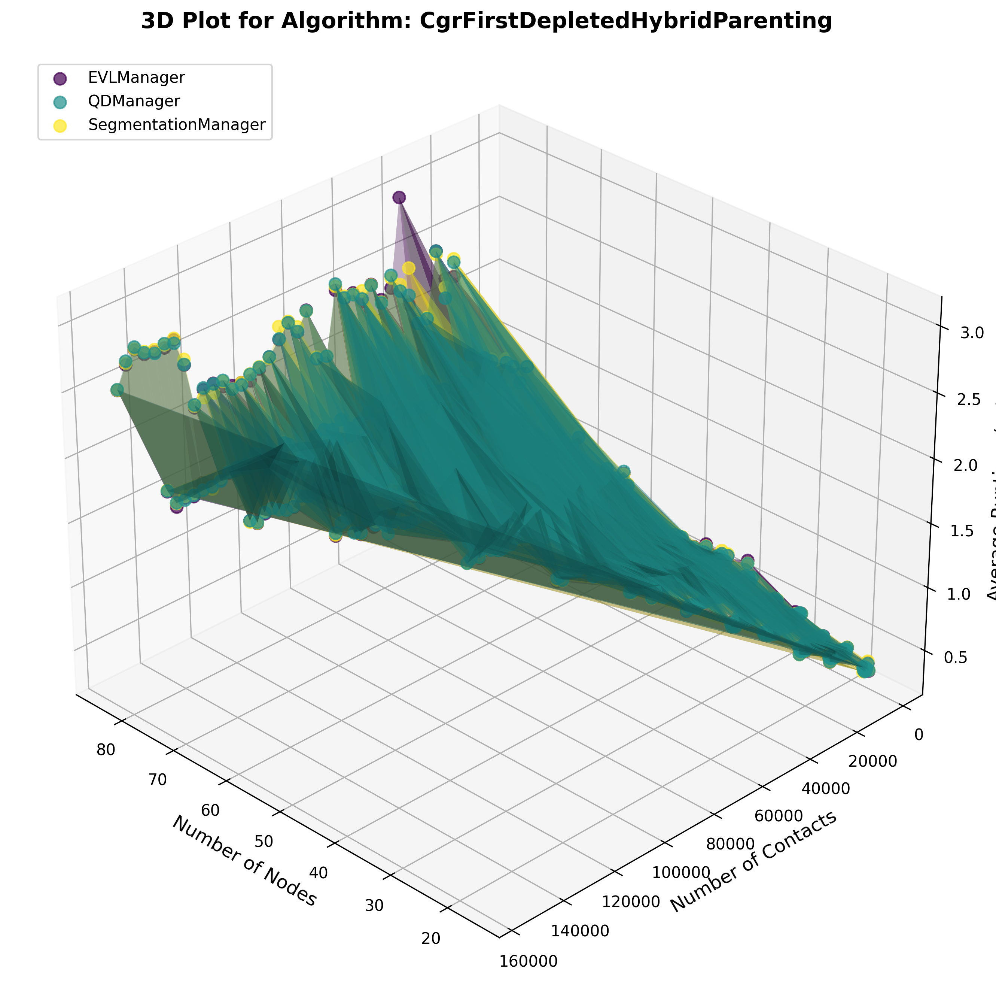

# Computational evaluations
## System specs
### System for ploting
Debian 12, i7-1260P (4 P-cores, 8 E-cores). The program always runs on a single P-core, and the CPU is kept in power‑saver mode to maintain frequencies below 1.6 GHz most of the time. Verified with:  
```bash
top  
watch -n1 "grep 'cpu MHz' /proc/cpuinfo"  
lscpu --all --extended  
```
### System for grid search
Windows 11, i3-12100F (4C8T). Running in power‑saver mode (around 1GHz, x8 to x10 ratio).

## Contact plans generation
- **Repository:** <https://gitlab.com/d3tn/dtn-tvg-util>  
- **Example Script:** <https://gitlab.com/d3tn/aiodtnsim/-/blob/master/examples/example_test_run.sh>  

### Contact plans generation example
```bash
# 1. Generate a ring road scenario
python3 -m tvgutil.tools.create_rr_scenario  --gs 40 --sats 40 --hotspots 0 --output 01_scenario.json --seed 1 -t 1751839200 ---satdbfile "cubesat_tvgutil_default.txt"
# 2. Choose nodes and predict contact plan
python3 -m tvgutil.tools.create_rr_tvg --rr s --duration 2592000 --minelev 10 --islrange 1000 --uplinkrate 9600 --downlinkrate 9600 --seed 2 --output 02_ptvg_100_.json 01_scenario.json
```
Starting at `-t` UNIX timestamp, there are 40 ground stations and 40 satellites, making a total of 80 nodes. The `start_time` is a UNIX timestamp. The `duration` is specified in seconds. The `--rr s` is used for the inter-satellite link type in the contact plan. `minelev` defines the minimum elevation angle for satellite trajectories-avoid adjusting this too much. `islrange` in km sets the minimum range for inter-satellite links. uplinkrate and downlinkrate specify the data rates.

### Contact plans generation and run A-SABR crate for grid search and ploting
* [Contact plan generation](./grid-search/generate_cp.sh)
* [Run grid search on win11](./grid-search/run_asabr.bat)
* [Run computational evaluation](./grid-search/run_asabr.sh)

## Fine tuning 1st grid search
The goal is to have a **overall view** of the run times and failure rates.
### 1-7days step of 1d, 10 to 80 nodes step of 10 nodes
high failure rate for 10 nodes, 0% failure rate achieved for SPSN/VolCGR between 20 nodes, 1-2days(1334-2758 contacts)  

### Fine tuning 1st grid search memo
Observed variability between two identical runs: one where the grid search occupied the entire CPU, and another where the CPU also handled other heavy tasks (e.g., parallel grid‑search threads). The only difference was system load, yet the results diverged. 

The i3‑12100F’s motherboard enforces a 200 W L1 power limit, which should not throttle performance when all cores are active. 

However each grid‑search process runs on a single physical core, but file I/O or context switches migrate execution to that core’s sibling hyper‑thread. This might be the cause?

The following grid search and final evaluations occupied the entire CPU without other load (hopefully win11 didn't schedule any service).

## Fine tuning 2nd grid search (nodes and contacts intervals)
The goal is to **find the "edges" between low and high failure rate**.  
### 1-3days step of 1d, 6 to 30 nodes step of 2 nodes
high failure rate before 18 nodes  
0% failure rate achieved for SPSN/VolCGR between 18 nodes, 2-3days(2264-3336 contacts)  
0% failure rate achieved for SPSN/VolCGR between 20 nodes, 2-3days(2364-3458 contacts)  
0% failure rate achieved for SPSN/VolCGR between 22 nodes, 1-2days(1898-3744 contacts)  
0% failure rate achieved for SPSN/VolCGR between 24 nodes, 1-2days(1884-3708 contacts)  
0% failure rate achieved for SPSN/VolCGR between 26 nodes, 1-2days(2354-4570 contacts)  
0% failure rate achieved for SPSN/VolCGR between 28 nodes, 1-2days(2534-5252 contacts)  
### 1-3days step of 6h, 12 to 32 nodes step of 4 nodes
0% failure rate achieved for SPSN/VolCGR between 20 nodes, 48-54h(2720-3064 contacts)  
0% failure rate achieved for SPSN/VolCGR between 24 nodes, 30-36h(2496-3024 contacts)  
0% failure rate achieved for SPSN/VolCGR between 28 nodes, 24-30h(2168-2734 contacts)  
### 1-3days step of 4h, 18 to 30 nodes step of 2 nodes (elapse 2s)
0% failure rate achieved for SPSN/VolCGR between 18 nodes, 52-56h(2262-2440 contacts)  
0% failure rate achieved for SPSN/VolCGR between 20 nodes, 40-44h(2458-2700 contacts)  
0% failure rate achieved for SPSN/VolCGR between 22 nodes, 32-36h(1870-2066 contacts)  
0% failure rate achieved for SPSN/VolCGR between 24 nodes, 28-32h(2200-2496 contacts)  
### 1-3days step of 4h, 18 to 30 nodes step of 2 nodes (elapse 3s)
0% failure rate achieved for SPSN/VolCGR between 20 nodes, 52-56h(3172-3452 contacts)  
0% failure rate achieved for SPSN/VolCGR between 22 nodes, 44-48h(2462-2722 contacts)  
0% failure rate achieved for SPSN/VolCGR between 24 nodes, 36-40h(2778-3084 contacts)  
0% failure rate achieved for SPSN/VolCGR between 26 nodes, 24-28h(2326-2710 contacts)  
0% failure rate achieved for SPSN/VolCGR between 28 nodes, 24-28h(2666-3090 contacts)  
### 1-3days step of 4h, 18 to 30 nodes step of 2 nodes (elapse 1s)
0% failure rate achieved for SPSN/VolCGR between 18 nodes, 36-40h(1566-1740 contacts)  
0% failure rate achieved for SPSN/VolCGR between 20 nodes, 24-28h(1470-1706 contacts)  

## Fine tuning 3rd grid search (elapse times and bundle sizes)
The goal of this tuning stage is to **increase the number of valid data points for plotting**, while keeping **simulation results valid** and **runtime low**.  
### Compare differences between 2 elapse times
  
  
  
  
  
  
  
  

## Computational evaluation and plotting
### Computational evaluation design
- **Node count (`nodes` axis):**  
  `tvgutil` uses a default CubeSat TLE file containing ~40 satellites. We pair each satellite with a ground station, so the total node count ranges from 4 to 84 (half ground stations, half satellites) in steps of 4. This yields 20 points on the `nodes` axis.

- **Contact count (`contacts` axis):**  
  We cannot directly set the number of contacts; instead, we adjust the scenario duration. Based on initial grid-search results, a 4 hour interval produces more than 20 points for small number of nodes counts with a failure rate below 1%.

- **Other parameters:**  
  - **Elapsed time interval:** 4s
  - **Maximum bundle size:** 1x10⁵

### Plots preview





## Problems
### Default URL
> `--satdburl SATDBURL` URL for fetching TLEs (default=celestrak)  
> dtn-tvg-util-master/tvgutil/ring_road/scenario.py:20:NORAD_CUBESAT_URL = "http://www.celestrak.com/NORAD/elements/cubesat.txt  
cubesat.txt contains around 90 satellites; however, tvgutil.tools.create_rr_scenario caps it at 42 (not sure why). Even if we could fully use all 90 satellites for evaluation, the node size would still be small. Also, the library limits the duration to 365 days (though maybe this can be modified to allow a larger CP just for the evaluation). Additionally, downloading from Celestrak every time got me a temporary IP ban, so use --satdbfile SATDBFILE instead.
```log
Traceback (most recent call last):
  File "<frozen runpy>", line 198, in _run_module_as_main
  File "<frozen runpy>", line 88, in _run_code
  File "/.venv/lib/python3.11/site-packages/tvgutil/tools/create_rr_scenario.py", line 128, in <module>
    _main(_get_argument_parser().parse_args())
  File "/.venv/lib/python3.11/site-packages/tvgutil/tools/create_rr_scenario.py", line 55, in _main
    sats = scenario.filter_satdb(
           ^^^^^^^^^^^^^^^^^^^^^^
  File "/.venv/lib/python3.11/site-packages/tvgutil/ring_road/scenario.py", line 58, in filter_satdb
    return random.sample(sats, sat_count)
           ^^^^^^^^^^^^^^^^^^^^^^^^^^^^^^
  File "/usr/lib/python3.11/random.py", line 456, in sample
    raise ValueError("Sample larger than population or is negative")
ValueError: Sample larger than population or is negative
```
### TLE file 
When using [active satellites](https://celestrak.org/NORAD/elements/gp.php?GROUP=active&FORMAT=tle) TLE from celestrack instead of default cubesat TLE:
```log
Created scenario file with 42 sat(s) and 42 gs(s).
Creating PCP: 42 sat(s), 42 gs(s), duration: 8736.0 h...
Predicting sat-gs contacts...
Traceback (most recent call last):
  File "<frozen runpy>", line 198, in _run_module_as_main
  File "<frozen runpy>", line 88, in _run_code
  File "/.venv/lib/python3.11/site-packages/tvgutil/tools/create_rr_tvg.py", line 229, in <module>
    _main(_get_argument_parser().parse_args())
  File "/.venv/lib/python3.11/site-packages/tvgutil/tools/create_rr_tvg.py", line 65, in _main
    rr0_contacts = get_rr0_contact_tuples(
                   ^^^^^^^^^^^^^^^^^^^^^^^
  File "/.venv/lib/python3.11/site-packages/tvgutil/ring_road/contact_plan.py", line 138, in get_rr0_contact_tuples
    contacts = [
               ^
  File "/.venv/lib/python3.11/site-packages/tvgutil/ring_road/contact_plan.py", line 139, in <listcomp>
    _get_zeros(gsobj, satobj, x, half_period, min_elev_rad)
  File "/.venv/lib/python3.11/site-packages/tvgutil/ring_road/contact_plan.py", line 52, in _get_zeros
    optimize.brentq(
  File "/.venv/lib/python3.11/site-packages/scipy/optimize/_zeros_py.py", line 846, in brentq
    r = _zeros._brentq(f, a, b, xtol, rtol, maxiter, args, full_output, disp)
        ^^^^^^^^^^^^^^^^^^^^^^^^^^^^^^^^^^^^^^^^^^^^^^^^^^^^^^^^^^^^^^^^^^^^^
ValueError: f(a) and f(b) must have different signs
```